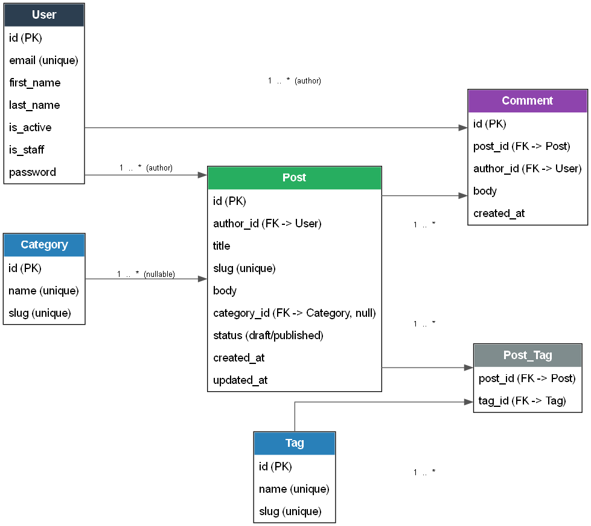

# blog-api

A blog REST API built with Django + Django REST Framework. Custom email-based user model,
JWT authentication, and posts/comments/categories/tags.

## Entity-Relationship Diagram



Source: [docs/erd.dot](docs/erd.dot) (Graphviz).

## Project structure

```
manage.py
requirements/
  base.txt        # shared dependencies
  dev.txt         # dev-only, -r base.txt
  prod.txt        # prod-only, -r base.txt
logs/              # log files (gitignored)
apps/
  auths/           # custom user model, JWT authentication
  blog/            # posts, comments, categories, tags
settings/          # Django project package + configuration root
  .env             # secrets (gitignored, see .env.example)
  conf.py          # reads .env via python-decouple
  base.py          # shared settings
  urls.py
  wsgi.py
  asgi.py
  env/
    local.py       # DEBUG=True, SQLite
    prod.py        # DEBUG=False, PostgreSQL
```

Load order: `manage.py` -> `settings/env/local.py` -> `settings/base.py` -> `settings/conf.py` -> `settings/.env`.

All environment variables are prefixed `BLOG_` (e.g. `BLOG_SECRET_KEY`, `BLOG_DB_NAME`).

## Setup

```bash
python -m venv .venv
.venv\Scripts\activate          # Windows
pip install -r requirements/dev.txt

copy settings\.env.example settings\.env   # then fill in real values

python manage.py migrate
python manage.py createsuperuser
python manage.py runserver
```

For a production install use `pip install -r requirements/prod.txt` and set `BLOG_ENV_ID=prod`
plus the PostgreSQL variables in `settings/.env`.

## API

Base path: `/api/`

### Auth (`/api/auth/`)

| Method | Endpoint         | Description                          | Auth required |
|--------|------------------|---------------------------------------|----------------|
| POST   | `register/`      | Create a new account                  | No             |
| POST   | `login/`         | Obtain access/refresh token pair      | No             |
| POST   | `refresh/`       | Exchange refresh token for new access | No             |
| POST   | `logout/`        | Blacklist a refresh token             | Yes            |
| GET    | `me/`            | Get the authenticated user's profile  | Yes            |
| PATCH  | `me/`            | Update the authenticated user's profile | Yes          |

Send the access token as `Authorization: Bearer <token>`.

### Blog (`/api/blog/`)

| Method            | Endpoint                              | Description                  |
|-------------------|----------------------------------------|-------------------------------|
| GET                | `categories/`, `tags/`                | List                          |
| POST               | `categories/`, `tags/`                | Create (authenticated)        |
| GET/PUT/PATCH/DEL  | `categories/<slug>/`, `tags/<slug>/`  | Retrieve/update/delete        |
| GET                | `posts/`                              | List posts (with comments)    |
| POST               | `posts/`                              | Create a post (authenticated) |
| GET/PUT/PATCH/DEL  | `posts/<slug>/`                       | Retrieve/update/delete (author only for write) |
| GET                | `comments/`, `comments/?post=<id>`    | List comments                 |
| POST               | `comments/`                           | Add a comment (authenticated), body includes `post` |
| GET/PUT/PATCH/DEL  | `comments/<id>/`                      | Retrieve/update/delete (author only for write) |

Write access to posts/comments is restricted to the resource's author; everyone else has
read-only access.

## Code standards

- PEP 8, enforced with `ruff` (`ruff check .`) — config in `pyproject.toml`.
- No magic strings/numbers — field lengths and choices are named constants.
- Import order: standard library + third party, then DRF, then Django, then local apps.
- `snake_case` for variables/functions, `PascalCase` for classes, `UPPER_CASE` for constants.
- Type hints on function arguments and return types.

## Git workflow

Work happens on a per-homework branch (`hw1`, `hw2`, ...) and is merged into `main` when done.
Branches are never deleted after merging.
